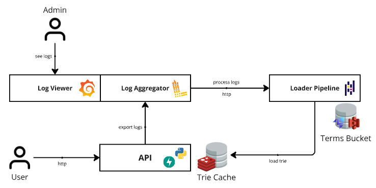

# Relevancer

## Introduction

A proof of concept of a system capable of searching for terms using trie trees based on the implementation described by Alex Xu, in the book [System Design Interview - An Insiders Guide: Volume 2](https://www.amazon.com/System-Design-Interview-Insiders-Guide/dp/1736049119)

## Archtecture

### Components

1. A Python API, which exposes the endpoints to search for terms
2. Instrumentation with the Grafana stack for aggregation and visualization of logs
3. A Pipeline implemented with Pandas, which will process logs and is implemented together with the API, for simplicity
4. An S3 Storage, implemented with LocalStack, to archive the terms and search frequency
5. A Redis, to cache the partitioned trie tree in order to speed up the search for terms.

### Happy Path

1. The API generates logs related to the terms searched by users;
2. These logs are exported to Grafana, where they will be aggregated and can even be visualized;
3. The API triggers the pipeline through an endpoint, which will request the logs from Grafana and will process them to update the terms file in S3.
4. Once the file is updated in S3, the trie tree referring to the terms is generated and saved in partitioned Redis, where it can be consulted in step 1.

